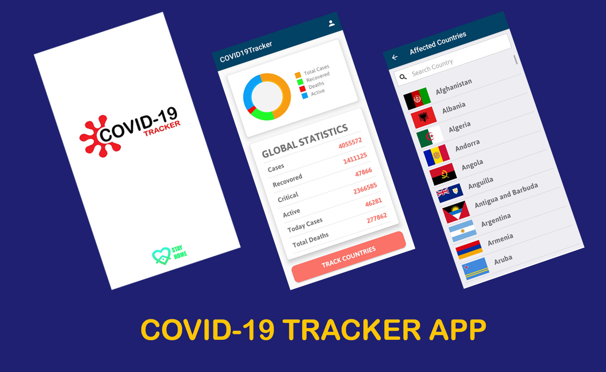

# COVID-19_tracker_app_using_REST_API

In this app, **REST API** is used to fetch the data in the app. Datas are updating according to the api. And in this app, we can get

the details of the every affected countries as well as Global data.

Also, for authentication **Google sigin** method is used in this app.
